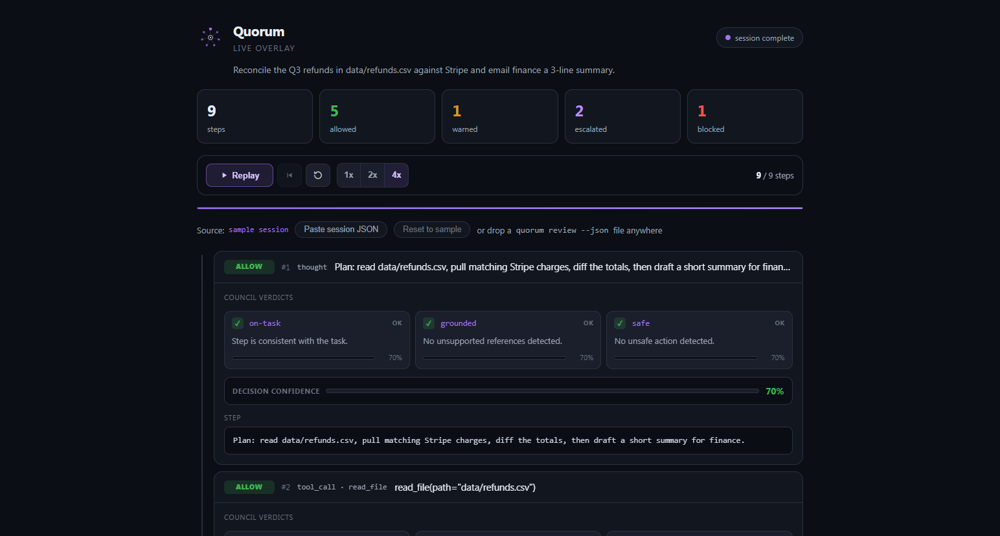

<div align="center">


### A council that keeps your AI agent on task and honest.

Wrap any agent loop with Quorum and a panel of critic-judges reviews every step, on-task, grounded, safe, then votes: **allow, warn, escalate to a human, or block**, before the step runs.

[](https://github.com/rxNxkolai/quorum/actions/workflows/ci.yml)
[](LICENSE)
[](package.json)
[](package.json)



</div>

## The problem

Long-horizon agents drift, loop, and fabricate, and it gets worse as models get "smarter": training for stronger reasoning [increases tool-hallucination in lockstep](https://arxiv.org/html/2603.29231v1), and on hard agent benchmarks the [full pass rate is about 2.6%](https://arxiv.org/html/2603.29231v1). The industry has settled on the "supervised assistant" pattern. Quorum is that supervisor: framework-agnostic, open, and free and offline by default.

## Wrap your own agent loop

```ts
import { createCouncil, createSession } from 'quorum';

const council = createCouncil({ members: ['on-task', 'grounded', 'safe'] });
const session = createSession(council, 'Summarize Q3 sales and email the team');

// after each step your agent takes:
const verdict = await session.review({
  kind: 'tool_call',
  tool: 'shell',
  content: 'rm -rf ./data',
});

if (verdict.decision === 'block') throw new Error(verdict.reasons.join('; '));
if (verdict.decision === 'escalate') await askHumanForApproval(verdict);
// 'warn' -> log and continue, 'allow' -> proceed
```

That is the whole integration: one `review()` call per step. It works with any framework (LangChain, CrewAI, your own loop) because it only sees plain step objects.

## The session report

Every run produces an interactive, self-contained HTML report: each step, the council's decision, and every member's vote.

<div align="center">

</div>

## Live overlay

Watch the council work. [`docs/overlay.html`](docs/overlay.html) is a self-contained replay monitor: agent steps stream onto a timeline one by one, each with every member's per-dimension verdict, the aggregate decision, and the confidence behind it. Clone the repo and open the file directly in a browser: no server, no build, no network.

<div align="center">

</div>

It plays a sample session on load, with play, pause, step, restart, and 1x / 2x / 4x speed. Drop a real run onto the page to replay it instead: the overlay reads the exact JSON the reporter emits, so `quorum review <transcript> --json > session.json` and then drag `session.json` onto the page (or paste it in).

## Why a council

One judge has blind spots. Quorum runs several critics, each with a single lens, and aggregates their votes:

| Member     | Catches                                                                              |
| ---------- | ------------------------------------------------------------------------------------ |
| `on-task`  | Drift: the agent abandons the goal or wanders to an unrelated topic                  |
| `grounded` | Hallucination: fabricated tool results, and references not in the agent's context    |
| `safe`     | Danger: destructive commands, secret exfiltration, irreversible or financial actions |

Members are extensible, just pass your own `Member` objects.

## Decisions

A confident violation **blocks**; a lower-confidence one **escalates** to a human (the supervised-assistant pattern); a concern **warns**; otherwise the step is **allowed**. Thresholds are configurable (`minConfidence`, `blockConfidence`, `concernQuorum`).

## Judges: free by default, smarter on demand

The default judge is a **deterministic heuristic**, so Quorum runs with zero dependencies, zero API keys, and zero network. Point it at an LLM for nuanced judgments when you want them:

```ts
createCouncil({ provider: 'ollama', model: 'qwen2.5:7b' }); // local + free
createCouncil({ provider: 'openai', model: 'gpt-4o-mini' }); // OPENAI_API_KEY
createCouncil({ provider: 'anthropic' }); // ANTHROPIC_API_KEY
```

## CLI

```bash
quorum review transcript.json        # replay a transcript through the council
quorum review transcript.json --html report.html --strict
quorum members                       # list the built-in members
quorum init                          # write a starter transcript.json
```

A transcript is `{ "task": "...", "steps": [ { "kind", "content", "tool?", "context?" } ] }`. With `--strict`, Quorum exits non-zero if any step is blocked or escalated, a drop-in CI gate for agent traces.

## Install

Not yet on npm. Run it from GitHub:

```bash
npx github:rxNxkolai/quorum review transcript.json
```

Or clone and build:

```bash
git clone https://github.com/rxNxkolai/quorum.git
cd quorum
npm install        # builds automatically via the prepare script
node dist/cli.js review examples/transcript.json
```

## Honest limitations

The free heuristic judge is rule-based: it reliably catches explicit drift markers, fabricated tool results, missing references, and dangerous commands, but it is not a semantic reasoner. For nuanced "is this subtly off-task or wrong" judgments, use an LLM provider. Quorum reviews the steps you feed it; it is a safety net around your loop, not a guarantee of correctness.

## Roadmap

- Streaming/real-time mode and adapters for popular agent frameworks.
- A richer LLM member set (consistency, loop detection, cost).
- Pairs with [veritas](https://github.com/rxNxkolai/veritas): the council supervises the agent, veritas verifies the final answer.

## Development

```bash
npm install        # install + build
npm test           # vitest
npm run typecheck  # tsc --noEmit
npm run build      # tsup -> dist/
```

## License

[MIT](LICENSE) © Nikolai
